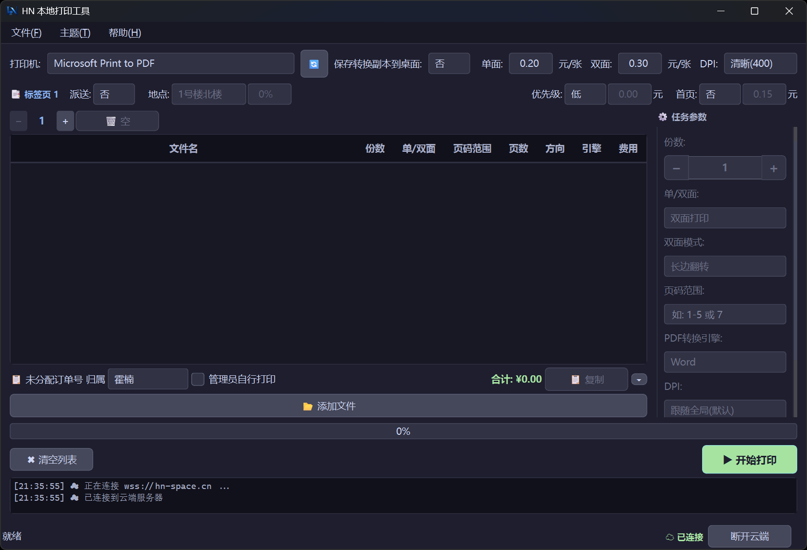
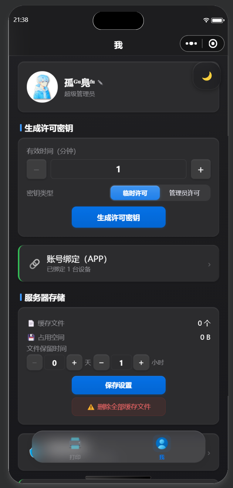
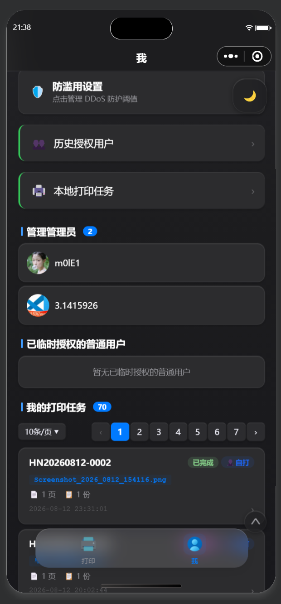

# HN 打印系统

一套面向"云端提交、本地自动打印"场景的打印管理解决方案，包含两个共享定价模型与打印管线的子系统：

| 子系统 | 目录 | 入口 | 用途 |
|--------|------|------|------|
| **本地打印工具** | `local_print_tool/` | `python main.py` | Windows 桌面应用（PySide6），拖放文件一键批量打印，同时接收云端打印任务 |
| **云打印系统** | `mobile_apps/` | 见下文 | 三组件：微信小程序 + Android App + Flask 后端 |

**桥接点**：`local_print_tool/cloud_client.py` 让本地打印工具也能接收云端任务（SocketIO 长连接 + HTTP 拉取双通道），但本地工具的主职仍是手动批量打印。

---

## 目录结构

```
.
├── local_print_tool/            # 本地打印工具（Windows 桌面应用）
│   ├── main.py                  # 程序入口
│   ├── gui.py                   # PySide6 主窗口
│   ├── converter.py             # 通用文件转 PDF（多引擎降级）
│   ├── pdf_printer.py           # PDF 静默打印（三级降级）
│   ├── printer_config.py        # PrintJob 数据类 / 配置读写 / 计费
│   ├── order_tabs.py            # Tab 标签栏 + 文件卡片组件
│   ├── cloud_client.py          # 云端任务接收（SocketIO + HTTP 双通道）
│   ├── offline_sync.py          # 离线订单暂存与自动上传
│   ├── stats_server.py          # 内置 HTTP 服务器（收支清算页 + API 代理）
│   ├── finance/settlement.html  # 收支清算页面
│   └── theme_manager.py         # 浅色/深色/跟随系统主题
├── mobile_apps/                 # 云打印系统
│   ├── h_n_print/               # 微信小程序（原生框架）
│   ├── android_app/             # Android App（Capacitor WebView，无需微信）
│   └── printer-backend/         # Flask + Flask-SocketIO + SQLite 后端
└── 放弃的项目（已重启）.7z       # 已废弃的早期版本备份归档，不再维护
```

---

## 本地打印工具（`local_print_tool/`）

Windows 桌面应用：拖放文件 / Ctrl+V 粘贴，自动转换格式后静默打印。



### 打印管线

```
文件 → 类型检测 → 转换引擎 → PDF → Windows GDI 打印（三级降级）
```

| 输入类型 | 转换方式 |
|----------|----------|
| PDF | PyMuPDF 渲染 300 DPI 位图 → GDI 打印（DEVMODE 配置） |
| Word | COM 自动化（Word → WPS → LibreOffice 兜底） |
| 图片 | reportlab 排入单页 PDF |
| Markdown / HTML | markdown 库 → wkhtmltopdf |
| TXT / CSV | reportlab 简单排版 |

### 核心特性

- **多引擎转换降级**：Microsoft Word COM → WPS COM → LibreOffice 三级智能降级，COM 后台预热
- **三级打印降级**：Windows GDI 原生 → SumatraPDF → 应用层循环
- **标签页系统**：每标签页独立文件列表与计费设置，`PrintJob.sent=True` 后锁定不可编辑
- **逐文件参数**：份数 / 双面 / 页码范围 / 渲染 DPI / 图片方向（自动/横向/竖向）
- **自动计费**：单面 0.2 元/页，双面 0.3 元/张（与后端 `calculate_price` 核心逻辑一致）
- **云任务接收**：SocketIO 长连接实时推送 + HTTP 拉取补充，断线自动重连
- **离线同步**：离线订单暂存本地 SQLite，联网后自动上传，最多重试 5 次
- **主题**：浅色 / 深色 / 跟随系统，写 `theme_settings.json`
- **收支清算**：内置 `finance/settlement.html`，日期流水自动归月、分模块密码、多人均摊、云端成员维度统计


### 外部依赖（Windows，需安装到系统）

- **Microsoft Word / WPS** — Office 文档转 PDF 首选引擎（比 LibreOffice 更可靠）
- **LibreOffice** — Office 转 PDF 兜底引擎（`soffice --headless`）
- **wkhtmltopdf** — HTML/Markdown 转 PDF
- **SumatraPDF** — Windows 静默打印二级兜底

### 快速开始

```bash
cd local_print_tool
pip install -r requirements.txt
python main.py
```

### 打包发布

两个 PyInstaller `.spec` 文件：

- `HN打印工具.spec` — Release 打包（无控制台）
- `HN打印工具_debug.spec` — Debug 打包（带控制台，用于现场排查崩溃）

构建输出在 `local_print_tool/dist/` 与 `local_print_tool/build/`。

### 已完成订单自动清理

`PrintJob.sent=True`（打印成功回报后置位并持久化）标记"已完成"，是清理与云端放弃的唯一判据：

- **退出时**（`closeEvent`）：若所有标签页的 job 全部 `sent` → 自动清空已完成订单（不弹窗；已完成云端任务不 `abandon`，仅清理 PDF 缓存）；存在未完成 job → 弹窗确认后清空并放弃未打印的云端任务/预留订单。
- **启动时**（`__init__`）：兜底清除上次崩溃/强杀遗留的"全部 job 已 `sent`"标签页。
- 部分完成（有 `sent` 有未 `sent`）的标签页一律保留，仍走退出确认弹窗。

---

## 云打印系统（`mobile_apps/`）

微信小程序 / Android App 提交打印任务 → Flask 后端存储分发 → Windows 本地工具自动打印。

| 小程序 · 打印界面 | 小程序 · 我的（1） | 小程序 · 我的（2） |
|---|---|---|
|  |  |  |

```
mobile_apps/
├── h_n_print/              # 微信小程序（原生框架，Component 模式 + 自定义 tabBar）
├── android_app/            # Android App（Capacitor WebView，纯 HTML/CSS/JS，无需微信）
└── printer-backend/        # Flask + Flask-SocketIO + SQLite + APScheduler 后端
```

### 父子订单模型

后端用两张表建模一次提交包含多个文件的场景：

- `orders` — 父订单容器，存聚合状态和附加服务参数（派送/加急/首页/地址）
- `order_files` — 子任务，每个文件一行，有独立的 `copies`、`page_range`、`duplex`、`status`

父订单状态通过 `aggregate_order_status()` 从子任务聚合：优先级 `failed > printing > queued > sent > canceled`，全部 `sent` 才算完成。本地工具的 `PrintJob` 数据类也对应子任务概念，`task_id` 字段存 `order_files.id`（0 = 本地任务）。

### 双通道任务分发

云端任务通过两条路径到达打印机：

1. **SocketIO 实时推送** — `push_print_task_to_client()` 原子标记子任务为 `printing` 后 `emit("print_task", ...)`
2. **HTTP 拉取** — `GET /api/pull_queued_orders`，`fetch_and_lock_task()` 用 `db_lock` + `BEGIN IMMEDIATE` 保证多打印机并发拉取不重复分配

两种路径都遵循"先锁后推"原则。

### MD5 文件去重

后端 `uploads/md5_index.json` 索引所有上传文件。同 MD5 文件复用磁盘存储，不同用户/订单共享同一物理文件，索引兼容新旧两种格式。本地工具 `cloud_client.py` 也有独立的 PDF 缓存（`pdf_cache/`），按源文件 MD5 索引，避免重复转换 Office 文档。

### 页数分析流程

Word 文档上传后页数未知（后端返回 0）：

1. 后端通过 SocketIO 推 `analyze_page_count` → 本地工具下载 → COM 转 PDF 统计页数 → 回报后端
2. 后端更新 `files.page_count` + `files.page_count_verified`，写入 MD5 索引
3. 下次同 MD5 文件上传直接复用已验证页数

### 断线恢复（多层防护）

- 客户端 `disconnect` → 回滚该客户端名下所有 `printing` 子任务 → `queued`
- `check_printing_timeout`（60s 定时）：超过 3 分钟未反馈的推送任务标记 `failed`
- `recover_orphaned_printing_tasks`（2min 定时）：超过 5 分钟的孤儿 `printing` 任务回退 `queued`
- 启动时 `recover_stale_printing_tasks()`：进程崩溃后残留的 `printing` 全部重置

### 角色与许可系统

`compute_role(openid)` → `super_admin` / `admin` / `user` / `guest`：

- `admin` 创建限时许可密钥（8 位字母数字，1-10 分钟有效），`guest` 兑换后获得临时 `temp_until`
- 提交订单时消费临时授权（`temp_until` 清空，关联 `license_keys.order_id`）
- `admin` 类型的永久密钥仅超级管理员可创建

**密钥即授权记录，已使用后永不删除**：`license_keys` 增加 `status` 列（unused/used/revoked/finished/archived）；作废、结束只改状态，不再硬删；`users` 增加 `removed_at`/`removed_by` 记录移除。已使用密钥（哪怕已过期）是授权历史，展示在"历史授权用户"（`/api/authorized_users`）。订单接口附带 `license_info`（订单消费的临时密钥）。

### 无障碍打印与预约打印（自动打印 + 指定时间/倒计时）

跨端三阶段：小程序提交 → 后端调度 → 本地到点自触发。涉及 `auto_print`、`schedule_mode`、`scheduled_at`、`schedule_frozen` 四个跨端字段。

- **小程序**：`auto_print` 开关（仅管理员可见）+ 开始方式 `schedule_mode = now | at | countdown`。倒计时秒数由前端换算随提交携带。
- **后端**（`process_scheduled_orders()`，30s 定时）：
  1. **阶段①文件下发**：提交时无在线打印机 → 子任务 `scheduled`；出现在线客户端时推送文件（`scheduled_download=True`）→ `downloading` → 下载完成 `waiting`。
  2. **到点兜底**：`waiting` 且 `scheduled_ts` 已到、未冻结 → 发 `start_print`（幂等冗余）。客户端超时未就绪 → 置 `schedule_frozen`，恢复在线后 `schedule_freeze_resume` 续排。
- **本地工具**（`gui.py`）：`_scheduled_orders` 状态机（每个 `order_id` 一个 dict），由 1s 定时器 `_check_scheduled_timeouts` 驱动，按 `scheduled_ts` 自触发打印、到点文件未就绪则冻结等待。`_auto_print_retry` 队列：打印机忙时暂存订单，当前批次完成后自动补打（只打未完成项）。

### 定价模型（两端共享）

单面 0.2 元/页，双面 0.3 元/张（每张印两页，奇数页最后一张按单面 0.2 元计费）。附加服务（派送百分比、加急费、首页费）在两端的 config 中都有对应字段。管理员提交的订单 `is_free=1`，不计费。

---

## 开发

### 本地打印工具

```bash
cd local_print_tool
pip install -r requirements.txt
python main.py
```

### 云打印后端（开发模式）

```bash
cd mobile_apps/printer-backend
pip install -r requirements.txt
cp config.py.example config.py   # 填写微信/服务器配置
python app.py                    # Flask 开发服务器，127.0.0.1:5000
```

### 微信小程序

用微信开发者工具打开 `mobile_apps/h_n_print/`。API 地址在 `utils/config.js` 的 `BASE_URL`，本地开发时在同目录创建 `config.local.js`（已排除 git）覆盖默认值：

```js
const LOCAL_CONFIG = { BASE_URL: 'https://你的地址' }
module.exports = { LOCAL_CONFIG }
```

### Android App（Capacitor WebView，无需微信）

```bash
cd mobile_apps/android_app
npx cap sync android && npx cap open android
# 开发预览：直接用浏览器打开 index.html
```

后端地址默认见 `www/app.js` 的 `DEFAULT_BASE_URL`；本地调试可用 `localStorage.setItem('hn_base_url', 'https://你的地址')` 覆盖。一键构建：`.\build-apk.ps1`（debug 包）；`.\build-release-apk.ps1`（发布包，正式签名 + 混淆，见 `android_app/README.md` 的「发布」章节）。

---

## 部署（生产环境）

需自行准备 Linux 服务器（Ubuntu 22.04+），配置域名指向、SSL 证书和反向代理。

```bash
# 后端打包 + 上传 + 重启（替换 YOUR_SERVER 为你的服务器地址）
cd mobile_apps/printer-backend
tar czf - --exclude='orders.db' --exclude='users.db' \
    --exclude='uploads' --exclude='__pycache__' \
    --exclude='venv' --exclude='*.pyc' . \
  | ssh root@YOUR_SERVER \
    "cd /home/printer-backend && tar xzf - && systemctl restart printer-backend"

# 验证
ssh root@YOUR_SERVER "systemctl status printer-backend --no-pager"
ssh root@YOUR_SERVER "curl -s http://127.0.0.1:5000/api/ping"
ssh root@YOUR_SERVER "journalctl -u printer-backend --since '5 minutes ago' --no-pager | tail -50"
```

生产环境建议（参照实际运行配置）：

- 服务以 systemd 托管，gunicorn + eventlet 运行（venv 与仓库分离）
- Nginx 反向代理（HTTPS），`/api/upload` 30r/m、其余 `/api/` 60r/m 的 IP 限速
- 每天凌晨备份数据库（`backup.sh` + crontab）
- 服务器上必须保留、不能被覆盖的运行时文件：`config.py`（含微信密钥/管理员 openid）、`uploads/`、`orders.db`、`users.db`、`venv/`、`logs/` 等（tar 打包时排除或只单独上传变更文件）

---

## 关键配置文件

| 文件 | 说明 |
|------|------|
| `local_print_tool/print_config.json` | 本地工具配置（打印机、价格、任务列表），自动生成，不提交 git |
| `local_print_tool/theme_settings.json` | 主题设置，自动生成，不提交 git |
| `mobile_apps/printer-backend/config.py` | 后端配置（需手动创建），含 `WECHAT_APPID`/`SECRET_KEY`/`ADMIN_OPENIDS` 等，不提交 git |
| `mobile_apps/printer-backend/pricing.json` | 定价配置，供小程序 `/api/pricing` 接口读取 |
| `mobile_apps/h_n_print/utils/config.js` | 小程序 API 地址 `BASE_URL` |
| `mobile_apps/h_n_print/utils/config.local.js` | 本地地址覆盖，不提交 git |
| `mobile_apps/android_app/android/app/release.keystore` | APP 发布签名 keystore，不提交 git（务必单独备份） |
| `mobile_apps/android_app/android/app/keystore.properties` | 发布签名密码/别名配置，不提交 git |

---

## 调试辅助

- `local_print_tool/crash_traceback.txt` — 记录未捕获异常的完整 traceback，打包后崩溃时优先查看
- 日志输出到 `local_print_tool/logs/local_tool.log`
- `HN打印工具_debug.spec` — Debug 打包（带控制台，用于现场排查崩溃）

---

## 更多细节

- 云打印系统子系统架构详见 `mobile_apps/CLAUDE.md`
- 后端部署与配置指南详见 `mobile_apps/printer-backend/DEPLOY.md`
- 仓库内 `AGENTS.md` / `CLAUDE.md` 为 AI 助手（Codex / Claude Code）指导文档，包含真实服务器 IP 与 SSH 密钥路径等运维信息，**仅本地参考，不进入 git**（已加入 `.gitignore`）

## License

MIT
